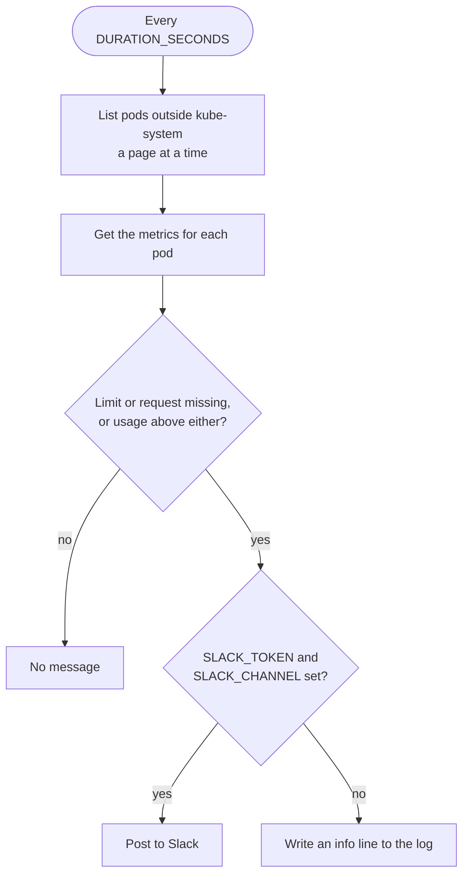

# Architecture

## Check loop

The monitor waits one interval after start-up before its first check, and checks again every interval after that. `DURATION_SECONDS` sets the interval, and [`resources/resources.go`](https://github.com/saidsef/pod-resources/blob/main/resources/resources.go) holds the loop.

Checks never overlap. When one runs past the interval, the next starts as soon as it finishes.

If listing pods fails, the monitor logs `Error retrieving pod info` and skips that check.

## Pod selection

Each check lists the pods in every namespace except `kube-system`. The monitor has no setting to skip any other namespace.

For each pod, the monitor fetches the pod's metrics once and checks every container in `spec.containers` against the rules in [Alerts](./alerts.md#checks). It skips init containers, so it also skips sidecars declared as init containers with `restartPolicy: Always`. [`checks.go`](https://github.com/saidsef/pod-resources/blob/main/resources/internal/resources/checks.go) holds the selection and the checks.

The Metrics API has no data for a pod that is not running, such as a Pending pod or a finished Job pod. It has none for a new pod that metrics-server has not sampled yet either. For each of those pods, the monitor logs `Error getting metrics for pod <pod> in namespace <namespace>` on every check and moves on to the next pod.

## Kubernetes API access

The monitor builds its clients from the in-cluster service account config, in [`auth.go`](https://github.com/saidsef/pod-resources/blob/main/resources/internal/auth/auth.go). Each check lists pods across the cluster, `podListPageSize` at a time, and makes one Metrics API request per pod, one after another.

The clients use client-go's default rate limit of 5 requests a second, with bursts of 10. At that rate the metrics requests for 600 pods take about two minutes, which is the whole default interval, so on a cluster that size the checks run back to back.

## Logging

The monitor writes JSON log lines to standard error through logrus, at `info` level and above. [Log output](./installation.md#log-output) shows the lines it writes.
